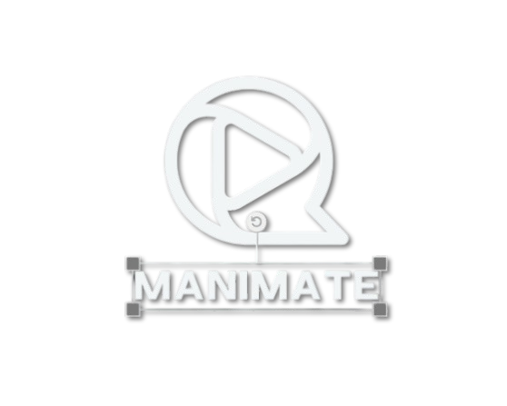

# 🎬 Manimate - AI-Powered Video Generation Platform

<div align="center">
  
  
  [](https://manimate-vision-forge.lovable.app/)
  [](LICENSE)
  [](https://reactjs.org/)
  [](https://www.typescriptlang.org/)
  [](https://tailwindcss.com/)
</div>

## 🌟 Live Demo

**Visit the live application:** [https://manimate-vision-forge.lovable.app/](https://manimate-vision-forge.lovable.app/)

---

## 🚀 About Manimate

Manimate is a revolutionary AI-powered platform that transforms your ideas into stunning educational videos using the power of **Manim** (Mathematical Animation Engine) and artificial intelligence. Whether you're explaining complex mathematical concepts, visualizing scientific phenomena, or creating educational content, Manimate makes professional animation accessible to everyone.

### ✨ Key Features

- **🧠 AI-Powered Generation**: Simply describe your animation idea, and our AI creates professional-quality videos
- **📚 Educational Focus**: Perfect for math, science, and technical visualizations
- **🎯 Zero Learning Curve**: No animation or coding expertise required
- **⚡ Fast Generation**: Get your videos in 30-60 seconds
- **🔐 Secure Authentication**: Built with Supabase for robust user management
- **📱 Responsive Design**: Works seamlessly across all devices

---

## 🛠 Technology Stack

### Frontend
- **React 18.3.1** - Modern UI framework
- **TypeScript** - Type-safe development
- **Tailwind CSS** - Utility-first styling
- **GSAP** - Professional animations
- **Lucide React** - Beautiful icons
- **shadcn/ui** - Premium component library

### Backend & Infrastructure
- **Supabase** - Database and authentication
- **Vite** - Lightning-fast build tool
- **React Router** - Client-side routing

### Animation Engine
- **Manim** - Mathematical animation engine
- **Custom AI Integration** - Intelligent prompt processing

---

## 🎯 Use Cases

### 📐 Mathematics
- Visualize geometric theorems
- Animate calculus concepts
- Demonstrate algebraic equations
- Explore statistical distributions

### 🔬 Science
- Illustrate physics principles
- Show chemical reactions
- Explain biological processes
- Visualize data structures

### 💻 Technology
- Explain algorithms
- Demonstrate neural networks
- Show system architectures
- Illustrate programming concepts

---

## 🎨 User Interface

### Modern & Intuitive Design
- **Glass-morphism effects** with backdrop blur
- **Smooth GSAP animations** for professional feel
- **Responsive layout** optimized for all screen sizes
- **Dark/Light theme** support
- **Gradient backgrounds** with animated orbs

### Professional Animation Effects
- Hero text reveal animations
- Staggered card animations
- Morphing background elements
- Parallax scrolling effects
- Interactive hover states

---

## 🚀 Getting Started

### Prerequisites
- Node.js 18+ 
- npm or yarn package manager

### Installation

1. **Clone the repository**
   ```bash
   git clone https://github.com/your-username/manimate.git
   cd manimate
   ```

2. **Install dependencies**
   ```bash
   npm install
   ```

3. **Set up environment variables**
   ```bash
   cp .env.example .env.local
   # Add your Supabase credentials
   ```

4. **Start development server**
   ```bash
   npm run dev
   ```

5. **Open your browser**
   ```
   http://localhost:5173
   ```

---

## 📁 Project Structure

```
src/
├── components/           # Reusable UI components
│   └── ui/              # shadcn/ui components
├── hooks/               # Custom React hooks
│   ├── useGSAPAnimations.ts  # GSAP animation hooks
│   └── useScrollAnimation.ts # Scroll-based animations
├── pages/               # Application pages
│   ├── Index.tsx        # Landing page
│   ├── AuthPage.tsx     # Authentication
│   └── GeneratePage.tsx # Video generation
├── integrations/        # External service integrations
│   └── supabase/        # Supabase configuration
└── lib/                 # Utility functions
```

---

## 🎬 How It Works

1. **🔐 Sign Up/Login** - Create your account with secure authentication
2. **✍️ Describe Your Idea** - Simply write what you want to animate
3. **🤖 AI Processing** - Our AI interprets your prompt and generates Manim code
4. **🎥 Video Creation** - The system renders your professional animation
5. **📺 View & Share** - Watch your video and share with others

---

## 🌟 Example Prompts

Try these example prompts to get started:

- *"A visualization of how neural networks learn"*
- *"The mathematical beauty of the Fibonacci sequence"*
- *"Explaining calculus derivatives with moving graphs"*
- *"A 3D tour through the solar system"*
- *"Animated explanation of the Pythagorean theorem"*

---

## 🔒 Authentication & Security

- **Supabase Authentication** - Industry-standard security
- **Row Level Security (RLS)** - Database-level protection
- **JWT Tokens** - Secure session management
- **Rate Limiting** - 2 generations per day for free users

---

## 🚀 Deployment

The application is deployed on **Lovable** platform with:

- **Automatic deployments** from main branch
- **Custom domain support** available
- **SSL certificates** included
- **Global CDN** for fast loading

**Live URL:** [https://manimate-vision-forge.livable.app/](https://manimate-vision-forge.lovable.app/)

---

## 🤝 Contributing

We welcome contributions! Please follow these steps:

1. Fork the repository
2. Create a feature branch (`git checkout -b feature/amazing-feature`)
3. Commit your changes (`git commit -m 'Add amazing feature'`)
4. Push to the branch (`git push origin feature/amazing-feature`)
5. Open a Pull Request

---

## 📄 License

This project is licensed under the MIT License - see the [LICENSE](LICENSE) file for details.

---

## 🙏 Acknowledgments

- **Manim Community** - For the amazing animation engine
- **Supabase Team** - For the excellent backend platform
- **shadcn** - For the beautiful UI components
- **Lovable Platform** - For seamless deployment

---

## 📞 Support

Need help? Here are ways to get support:

- 📧 Email: support@manimate.com
- 💬 Discord: [Join our community](https://discord.gg/manimate)
- 📚 Documentation: [docs.manimate.com](https://docs.manimate.com)
- 🐛 Issues: [GitHub Issues](https://github.com/your-username/manimate/issues)

---

<div align="center">
  <h3>Built with ❤️ by the Manimate Team</h3>
  <p>Transform your ideas into stunning visual stories</p>
  
  **[Visit Manimate →](https://manimate-vision-forge.lovable.app/)**
</div>