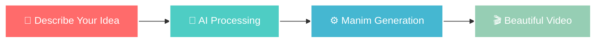

# 🎬 Manimate

<div align="center">
  
  
  **Transform your ideas into stunning educational videos with AI**
  
  <p>
    <a href="#getting-started">
      
    </a>
    <a href="#examples">
      
    </a>
  </p>

  <p>
    
    
    
    
  </p>
</div>

---

## 🌟 Live Demo

<div align="center">
  
  ### 🚀 Experience Manimate in Action
  
  <p><strong>See the magic happen in real-time!</strong></p>
  
  <a href="https://manimate-vision-forge.lovable.app/" target="_blank">
    
  </a>
  
  <br><br>
  
  <p>
    ✅ <strong>No installation required</strong> • Works in any modern browser<br>
    ✅ <strong>Try it instantly</strong> • Create your first animation in seconds<br>
    ✅ <strong>Free to explore</strong> • Experience the full power of AI-driven animation
  </p>
  
</div>

---

## ✨ What is Manimate?

> **Imagine describing a complex mathematical concept in plain English and watching it come to life as a professional educational video in seconds.**

Manimate is a revolutionary AI-powered platform that bridges the gap between ideas and visual storytelling. Using the power of **Manim** (Mathematical Animation Engine) and cutting-edge artificial intelligence, we make professional-quality educational animations accessible to everyone—from students to professors, from content creators to researchers.

### 🎯 The Magic Behind Manimate

<table>
<tr>
<td width="50%">

**🧠 AI-Powered Generation**
Simply describe your animation idea in natural language, and watch as our sophisticated AI transforms your words into stunning visual narratives.

**⚡ Lightning Fast**
From idea to video in 30-60 seconds. No more weeks of animation work—get professional results instantly.

</td>
<td width="50%">

**🎓 Educational Focus**
Specifically designed for mathematics, science, and technical visualizations that make complex concepts crystal clear.

**🚀 Zero Learning Curve**
No animation experience? No coding skills? No problem. If you can describe it, Manimate can animate it.

</td>
</tr>
</table>

---

## 🌟 Why Choose Manimate?

<div align="center">
  <table>
    <tr>
      <td align="center" width="33%">
        
        <h3>Professional Quality</h3>
        <p>Manim-powered animations that rival expensive production studios</p>
      </td>
      <td align="center" width="33%">
        
        <h3>Secure & Reliable</h3>
        <p>Built with Supabase for enterprise-grade security and performance</p>
      </td>
      <td align="center" width="33%">
        
        <h3>Universal Access</h3>
        <p>Works seamlessly across all devices and screen sizes</p>
      </td>
    </tr>
  </table>
</div>

---

## 🎮 How It Works

<div align="center">



</div>

1. **🔐 Sign Up** - Create your account with secure authentication
2. **✍️ Describe** - Write what you want to animate in plain English
3. **🤖 AI Magic** - Our AI interprets and generates professional Manim code
4. **🎥 Render** - Watch as your idea transforms into a stunning video
5. **📺 Share** - Download, view, and share your creation with the world

---

## 🎨 Perfect For Every Use Case

<details>
<summary><strong>📐 Mathematics & Engineering</strong></summary>

- **Geometric Theorems** - Visualize Pythagorean theorem, triangle properties
- **Calculus Concepts** - Animate derivatives, integrals, limits
- **Linear Algebra** - Show matrix transformations, vector operations
- **Statistics** - Demonstrate distributions, probability concepts
- **Engineering** - Visualize signal processing, control systems

</details>

<details>
<summary><strong>🔬 Science & Research</strong></summary>

- **Physics Principles** - Illustrate wave mechanics, thermodynamics
- **Chemistry** - Show molecular interactions, reaction mechanisms
- **Biology** - Explain cellular processes, genetic concepts
- **Astronomy** - Visualize planetary motion, stellar evolution
- **Data Science** - Animate machine learning algorithms, data flows

</details>

<details>
<summary><strong>💻 Technology & Programming</strong></summary>

- **Algorithms** - Demonstrate sorting, searching, graph algorithms
- **Data Structures** - Show trees, graphs, hash tables in action
- **Neural Networks** - Visualize backpropagation, training processes
- **System Architecture** - Illustrate microservices, database design
- **Cryptography** - Explain encryption, digital signatures

</details>

---

## 🚀 Getting Started

### Prerequisites

```bash
# Ensure you have Node.js 18+ installed
node --version  # Should be 18.0.0 or higher
```

### Quick Installation

```bash
# 1. Clone the magic ✨
git clone https://github.com/your-username/manimate.git
cd manimate

# 2. Install dependencies 📦
npm install

# 3. Set up your environment 🔧
cp .env.example .env.local
# Add your Supabase credentials (see setup guide below)

# 4. Launch the application 🚀
npm run dev

# 5. Open your browser and visit 🌍
# http://localhost:5173
```

### Environment Setup

Create your `.env.local` file with:

```env
VITE_SUPABASE_URL=your_supabase_url
VITE_SUPABASE_ANON_KEY=your_supabase_anon_key
```

<details>
<summary><strong>🔧 Detailed Setup Instructions</strong></summary>

1. **Supabase Setup**:
   - Visit [supabase.com](https://supabase.com)
   - Create a new project
   - Copy your project URL and anon key
   - Paste them in your `.env.local` file

2. **Database Schema**:
   ```sql
   -- Run this in your Supabase SQL editor
   CREATE TABLE user_generations (
     id UUID DEFAULT gen_random_uuid() PRIMARY KEY,
     user_id UUID REFERENCES auth.users(id),
     prompt TEXT NOT NULL,
     video_url TEXT,
     created_at TIMESTAMP DEFAULT NOW()
   );
   ```

3. **Row Level Security**:
   ```sql
   ALTER TABLE user_generations ENABLE ROW LEVEL SECURITY;
   
   CREATE POLICY "Users can view own generations" ON user_generations
     FOR SELECT USING (auth.uid() = user_id);
   ```

</details>

---

## 🏗️ Project Architecture

```
src/
├── 🎨 components/          # Beautiful, reusable UI components
│   └── ui/                 # shadcn/ui design system
├── 🪝 hooks/               # Custom React hooks for magic
│   ├── useGSAPAnimations.ts    # Smooth GSAP animations
│   └── useScrollAnimation.ts   # Scroll-based effects
├── 📄 pages/               # Application pages
│   ├── Index.tsx           # Landing page with hero
│   ├── AuthPage.tsx        # Secure authentication
│   └── GeneratePage.tsx    # AI generation interface
├── 🔗 integrations/        # External service connections
│   └── supabase/          # Database & auth config
└── 🛠️ lib/                # Utility functions
```

---

## ✨ Examples That Will Inspire You

<div align="center">

### 🎯 Try These Prompts

</div>

<table>
<tr>
<td width="50%">

```text
🧮 "Create an animation showing how 
the Fibonacci sequence appears in 
nature, with a spiral forming from 
the mathematical sequence"
```

```text
🧠 "Visualize how a neural network 
learns to recognize handwritten 
digits, showing the weights changing 
during training"
```

</td>
<td width="50%">

```text
📐 "Animate the proof of the 
Pythagorean theorem using visual 
squares and transformations"
```

```text
🌊 "Show how sound waves interfere 
with each other, creating constructive 
and destructive interference patterns"
```

</td>
</tr>
</table>

<div align="center">
  <p><strong>🎬 Each prompt generates a professional 30-60 second video!</strong></p>
</div>

---

## 🎨 Built with Cutting-Edge Technology

<div align="center">

### Frontend Excellence
<p>
  
  
  
  
</p>

### Backend & Infrastructure
<p>
  
  
  
</p>

### Design & UX
<p>
  
  
  
</p>

</div>

---

## 🤝 Contributing

We believe in the power of community! Here's how you can contribute:

<div align="center">

| 🐛 Found a Bug? | 💡 Have an Idea? | 🎨 Want to Improve UI? | 📚 Love Documentation? |
|:---:|:---:|:---:|:---:|
| [Report Issues](https://github.com/nitindavegit/manimate/issues) | [Feature Requests](https://github.com/nitindavegit/manimate/issues) | [UI/UX Improvements](https://github.com/nitindavegit/manimate/pulls) | [Improve Docs](https://github.com/nitindavegit/manimate/pulls) |

</div>

### Development Workflow

```bash
# 1. Fork the repository on GitHub
# 2. Clone your fork
git clone https://github.com/YOUR_USERNAME/manimate.git

# 3. Create a feature branch
git checkout -b feature/amazing-new-feature

# 4. Make your changes and commit
git commit -m "✨ Add amazing new feature"

# 5. Push and create a pull request
git push origin feature/amazing-new-feature
```

---

## 📊 Performance & Analytics

<div align="center">
  <table>
    <tr>
      <td align="center">
        <h3>⚡ Performance</h3>
        <p><strong>30-60s</strong><br>Generation Time</p>
      </td>
      <td align="center">
        <h3>📱 Compatibility</h3>
        <p><strong>100%</strong><br>Mobile Responsive</p>
      </td>
      <td align="center">
        <h3>🔒 Security</h3>
        <p><strong>Enterprise</strong><br>Grade Protection</p>
      </td>
      <td align="center">
        <h3>🌍 Global</h3>
        <p><strong>CDN</strong><br>Powered Delivery</p>
      </td>
    </tr>
  </table>
</div>

---

## 📞 Get Help & Support

<div align="center">

### We're Here to Help! 🤗

<p>
  <a href="mailto:support@manimate.com">
    
  </a>
</p>

<p>
  <a href="https://discord.gg/manimate">
    
  </a>
  <a href="https://docs.manimate.com">
    
  </a>
</p>

<p>
  <a href="https://github.com/your-username/manimate/issues">
    
  </a>
</p>

</div>

---

## 📄 License

<div align="center">

This project is licensed under the **MIT License** - see the [LICENSE](LICENSE) file for details.

**TL;DR**: You can use, modify, and distribute this project freely! 🎉

</div>

---

## 🙏 Acknowledgments

<div align="center">

### Standing on the Shoulders of Giants

We're grateful to these amazing projects and communities:

<table>
<tr>
<td align="center">
  
  <br><strong>Manim Community</strong>
  <br><small>The incredible animation engine</small>
</td>
<td align="center">
  
  <br><strong>Supabase Team</strong>
  <br><small>Powering our backend</small>
</td>
<td align="center">
  
  <br><strong>shadcn/ui</strong>
  <br><small>Beautiful components</small>
</td>
<td align="center">
  
  <br><strong>Lovable Platform</strong>
  <br><small>Seamless deployment</small>
</td>
</tr>
</table>

</div>

---

<div align="center">
  
  ## 🌟 Ready to Transform Your Ideas?
  
  <p><strong>Join thousands of educators, students, and creators who are already using Manimate to bring their ideas to life!</strong></p>
  
  <a href="https://manimate-vision-forge.lovable.app/" target="_blank">
    
  </a>
  
  <p><em>✨ Transform your ideas into stunning visual stories ✨</em></p>
  
  <p>
    <strong>Made with ❤️ by the Manimate Team</strong>
  </p>
  
  ---
  
  <p><small>⭐ If you love Manimate, give us a star on GitHub! ⭐</small></p>
  
</div>
